# Kind Kubeseal

Deploy KinD cluster with Calico

```
kind create cluster --config kind-mk-config.yaml --name kubeseal
```

## View Cluster

```
kubectl get nodes
NAME                  STATUS     ROLES           AGE   VERSION
NAME                   STATUS   ROLES           AGE    VERSION
argocd-control-plane   Ready    control-plane   103m   v1.35.0
argocd-worker          Ready    <none>          102m   v1.35.0
argocd-worker2         Ready    <none>          102m   v1.35.0
```

## Install Calico

By default, *kind* comes with it's own cni called *kindnetd*. This has been disabled in *kind-mk-config.yaml* and Calico will be installed.

Why Calico? It's all about them **B**'s, them **G**'s, and them **P**'s.


[KIND](https://www.tigera.io/project-calico/)

```
kubectl create -f https://raw.githubusercontent.com/projectcalico/calico/v3.31.4/manifests/tigera-operator.yaml
```

**You'll need to run this as we've set a custom cidr block**:

```
kubectl apply -f calico-custom-resource.yaml
```

Verify Installation

```
watch kubectl get pods -l k8s-app=calico-node -A
```

>[!TIP]
> MacOS zsh does not have watch, brew install watch

# ArgoCD

<details> 
<summary>Install ArgoCD</summary>


Add **argo** repo:

```
helm repo add argo https://argoproj.github.io/argo-helm
```

Install ArgoCD:

```
helm install argocd argo/argo-cd --create-namespace -n argocd -f argo-values.yaml 
```

I'm passing a custom values file to attempt to bypass the *Lease* exclusion error by altering the default values and allocating the Argo Server NodePort so it does not have to be a manual process.

Output:

```
NAME: argocd
LAST DEPLOYED: Fri Feb  6 12:18:55 2026
NAMESPACE: argocd
STATUS: deployed
REVISION: 1
TEST SUITE: None
NOTES:
In order to access the server UI you have the following options:

1. kubectl port-forward service/argocd-server -n argocd 8080:443

    and then open the browser on http://localhost:8080 and accept the certificate

2. enable ingress in the values file `server.ingress.enabled` and either
      - Add the annotation for ssl passthrough: https://argo-cd.readthedocs.io/en/stable/operator-manual/ingress/#option-1-ssl-passthrough
      - Set the `configs.params."server.insecure"` in the values file and terminate SSL at your ingress: https://argo-cd.readthedocs.io/en/stable/operator-manual/ingress/#option-2-multiple-ingress-objects-and-hosts


After reaching the UI the first time you can login with username: admin and the random password generated during the installation. You can find the password by running:

kubectl -n argocd get secret argocd-initial-admin-secret -o jsonpath="{.data.password}" | base64 -d

(You should delete the initial secret afterwards as suggested by the Getting Started Guide: https://argo-cd.readthedocs.io/en/stable/getting_started/#4-login-using-the-cli)

```

Verify:

```
kubectl get po -n argocd
```

Retrieve the password from the secrets in argocd 

```
kubectl get secret argocd-initial-admin-secret -n argocd -o jsonpath="{.data.password}" | base64 -d; echo
```

Now you can log into ArgoCD at [https://localhost:30080](https://localhost:30080)

Username: admin <br/>
Password: from above

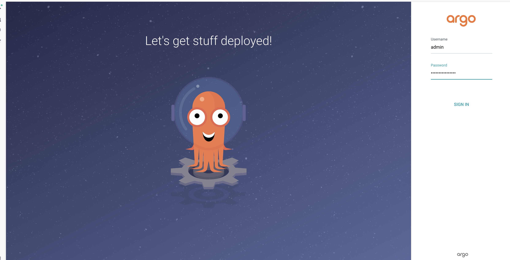

We will do changes from argocd cli 

</details>

# Git

<details>
<summary> Set Up Git </summary>

Create lab ssh deploy keys

```
C.Wise@GJ4HFVQPGW ~ % ssh-keygen -t rsa -b 4096
Generating public/private rsa key pair.
Enter file in which to save the key (/Users/C.Wise/.ssh/id_rsa): /Users/C.Wise/.ssh/argo-lab
Enter passphrase for "/Users/C.Wise/.ssh/argo-lab" (empty for no passphrase): 
Enter same passphrase again: 
Your identification has been saved in /Users/C.Wise/.ssh/argo-lab
Your public key has been saved in /Users/C.Wise/.ssh/argo-lab.pub
The key fingerprint is:
SHA256:biTgtco6VHDcoJa5WpSlQGnQaFKEyeu4kEdPevGNwNY C.Wise@GJ4HFVQPGW
The key's randomart image is:
+---[RSA 4096]----+
|*O+.oo           |
|=*oBo .          |
|+ X+...          |
| +.oBoE.         |
|ooo*.+ooS        |
|+++.o.o+.        |
|o+ .o   o        |
|. ..   .         |
|  ..             |
+----[SHA256]-----+
```

Paste the public key in the repository [kind-argo-repo](https://github.com/cwise24/kind-argo-repo). <br/>
From the repository, go to *Settings*:


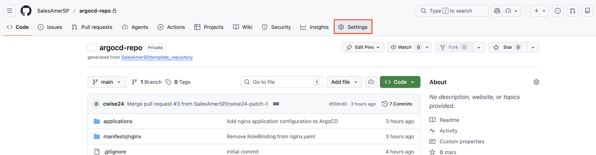

Down the left hand side click on *Deploy keys* to add your public key.

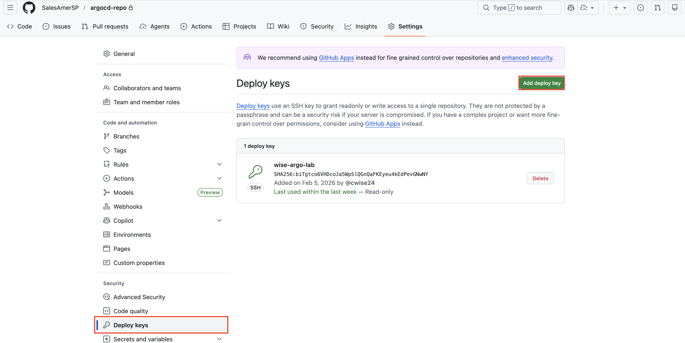

Now you can move back to the ArgoCD ui to connect to the Github repository.

Add git repo to ArgoCD, click gear icon on left:

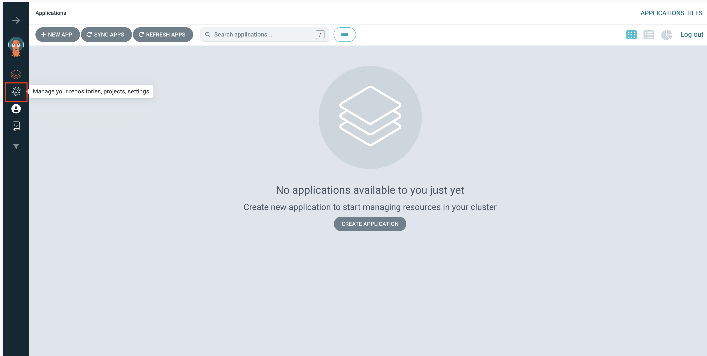

Click *Connect Repo*

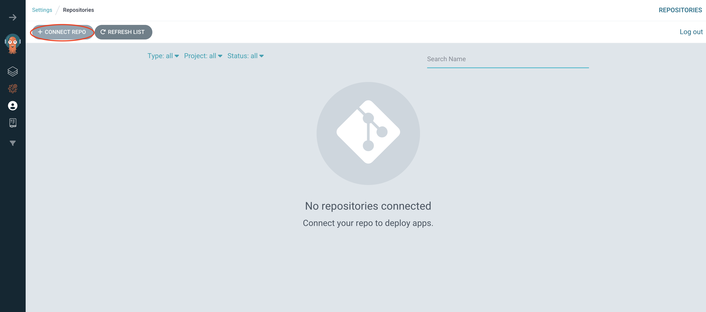

Now open the Repositories blade:

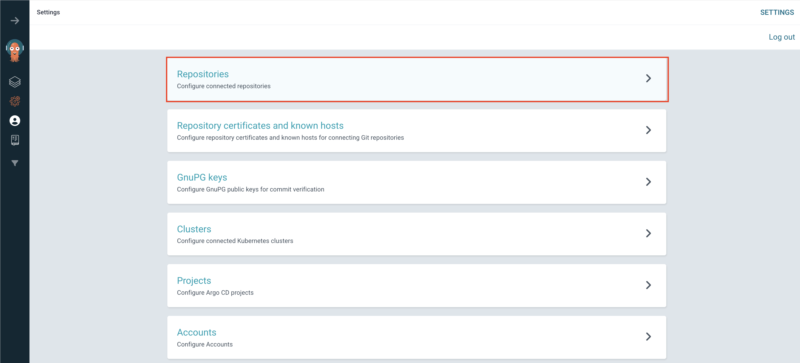

Now you must fill out the information for the repository. Notice the repository url, choose the *git@github.com:cwise24/kind-argo-repo.git*. You can get this from the repository site when you clone.

```
git@github.com:cwise24/kind-argo-repo.git
```

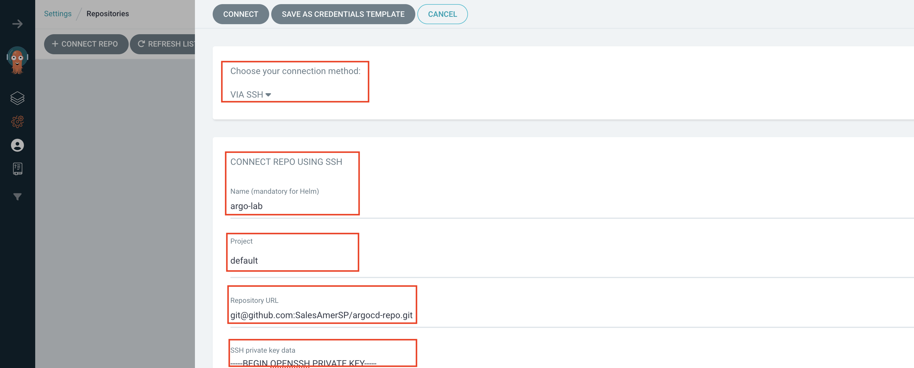

Also, take time to scroll and view all the options when setting up the repository.

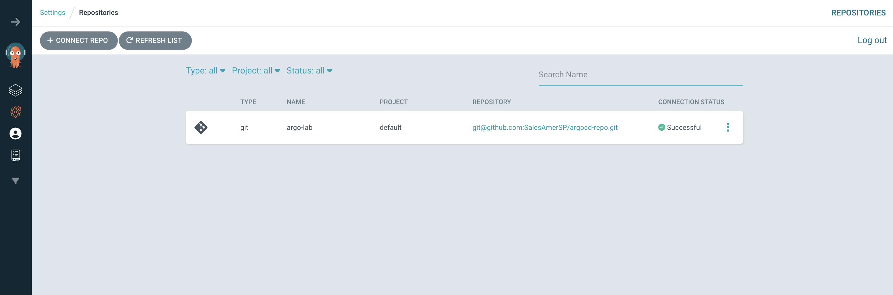

You should now see the above screen.

</details>

# Helm install of sealed secrets

[repo](https://github.com/bitnami-labs/sealed-secrets)

By default, this will run in the namespace *kube-system* and the below helm install commands will install there.

```
helm repo add sealed-secrets https://bitnami-labs.github.io/sealed-secrets
```

```
helm upgrade --install sealed-secrets sealed-secrets/sealed-secrets -f sealedsec-values.yaml -n kube-system
```

Output:

```
Release "sealed-secrets" does not exist. Installing it now.
NAME: sealed-secrets
LAST DEPLOYED: Tue Feb 24 09:12:26 2026
NAMESPACE: kube-system
STATUS: deployed
REVISION: 1
DESCRIPTION: Install complete
TEST SUITE: None
NOTES:
** Please be patient while the chart is being deployed **

You should now be able to create sealed secrets.

1. Install the client-side tool (kubeseal) as explained in the docs below:

    https://github.com/bitnami-labs/sealed-secrets#installation-from-source

2. Create a sealed secret file running the command below:

    kubectl create secret generic secret-name --dry-run=client --from-literal=foo=bar -o [json|yaml] | \
    kubeseal \
      --controller-name=sealed-secrets \
      --controller-namespace=kube-system \
      --format yaml > mysealedsecret.[json|yaml]

The file mysealedsecret.[json|yaml] is a commitable file.

If you would rather not need access to the cluster to generate the sealed secret you can run:

    kubeseal \
      --controller-name=sealed-secrets \
      --controller-namespace=kube-system \
      --fetch-cert > mycert.pem

to retrieve the public cert used for encryption and store it locally. You can then run 'kubeseal --cert mycert.pem' instead to use the local cert e.g.

    kubectl create secret generic secret-name --dry-run=client --from-literal=foo=bar -o [json|yaml] | \
    kubeseal \
      --controller-name=sealed-secrets \
      --controller-namespace=kube-system \
      --format [json|yaml] --cert mycert.pem > mysealedsecret.[json|yaml]

3. Apply the sealed secret

    kubectl create -f mysealedsecret.[json|yaml]

Running 'kubectl get secret secret-name -o [json|yaml]' will show the decrypted secret that was generated from the sealed secret.

Both the SealedSecret and generated Secret must have the same name and namespace.
```


## Lab

With *sealed-secrets* installed, we can now test how to use it.

In the repository, you have a file called *secret.yaml*. This is a basic secret file that we will use to test the functionality. You will need to first obtain the public key from the sealed secrets controller.

```
kubeseal --fetch-cert > pub.pem
```
From this point, we have a couple of options.

**1.** You can encrypt the secret file with the public key.

```
kubeseal --cert pub.pem --format yaml < secret.yaml > sealed-secret.yaml
```

> [!NOTE] 
> If you choose this route, please make sure to move the new sealed secret file to the kubeseal folder. This is where ArgoCD will look for the sealed secret file.

**2.** We can use the Git *Pre-Commit hook* magic to handle this for us. How do we do this?

Install the pre-commit Framework:

```
brew install pre-commit
```

Make sure the *.pre-commit-config.yaml* is in the root of your repository. And run:

```
pre-commit install
```
With your new pre-commit hook, you can now add your secret file to the repository.

```
cp secret.yaml kubeseal/.
```

Normal git ops process to stage and commit

```
git add kubeseal/secret.yaml
git commit -m "new secret"
```
Now you can view you file in the local and remote repository to see it's encrypted.

Finally a push:

```
git push
```

Let's pause here to understand what is happening. In Git, the pre-commit hook is a script that runs before a commit is made. In this case, we are using it to run the kubeseal command to encrypt the secret file. The script will run the kubeseal command and output the encrypted file (with appended -sealed to the name) to the same folder. There are many *git hooks* available, you can find them [here](https://git-scm.com/docs/githooks).


Notice your new *pre-commit* hook below:

```
applypatch-msg.sample		    pre-applypatch.sample		  pre-push.sample			      push-to-checkout.sample
commit-msg.sample		        pre-commit			          pre-rebase.sample		      sendemail-validate.sample
fsmonitor-watchman.sample	  pre-commit.sample		      pre-receive.sample		    update.sample
post-update.sample		      pre-merge-commit.sample		prepare-commit-msg.sample
```

For this, I choose option 2. 

Create application file to utilize the sealed secret. 

> [!NOTE]
> **You will need to update the repoURL to your own repository**

```
apiVersion: argoproj.io/v1alpha1
kind: Application
metadata:
  name: sealed-secrets
  namespace: argocd
spec:
  project: default
  source:
    repoURL: git@github.com:cwise24/kind-kubeseal.git
    targetRevision: HEAD
    path: kubeseal
  destination:
    namespace: default
    server: https://kubernetes.default.svc
  syncPolicy:
    syncOptions:
      - ServerSideApply=true
    automated:
      prune: true
      selfHeal: true
```
# ArgoCD Application Install

<details>
<summary> Add application </summary>

Add application, for this we will use the *sealedsec-app.yaml*. This step is **ONLY** used if you want Argo to deploy sealed secrets and you did **NOT** install already via helm.
 

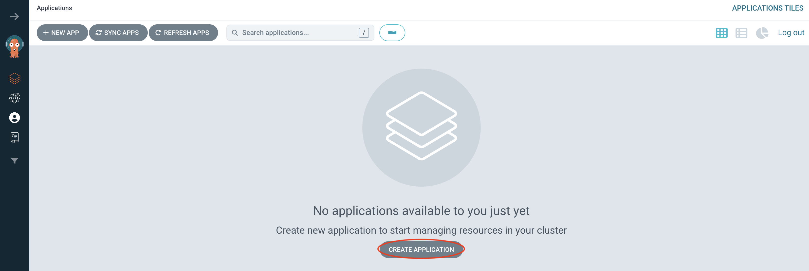

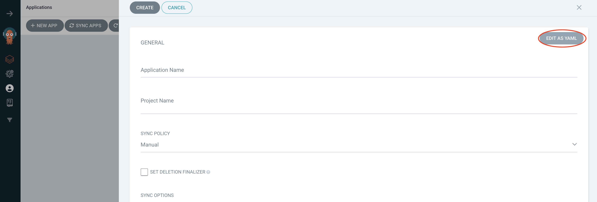

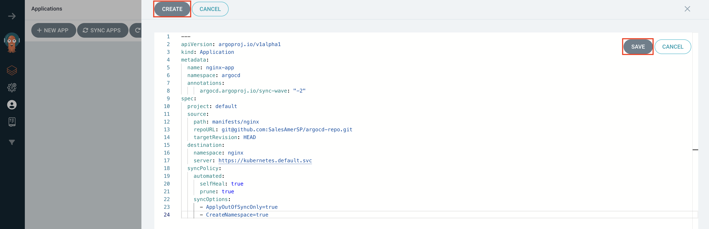


Click create to finalize the creation process

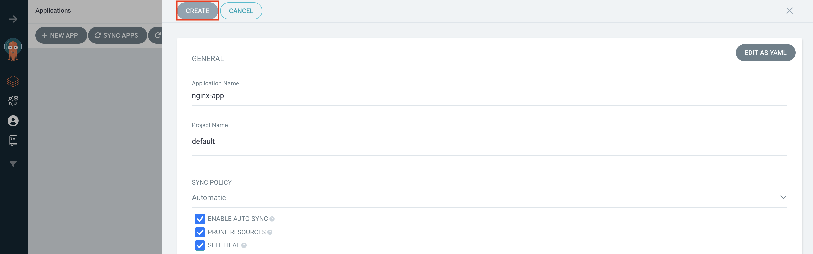

You can view the application by clicking the tile:

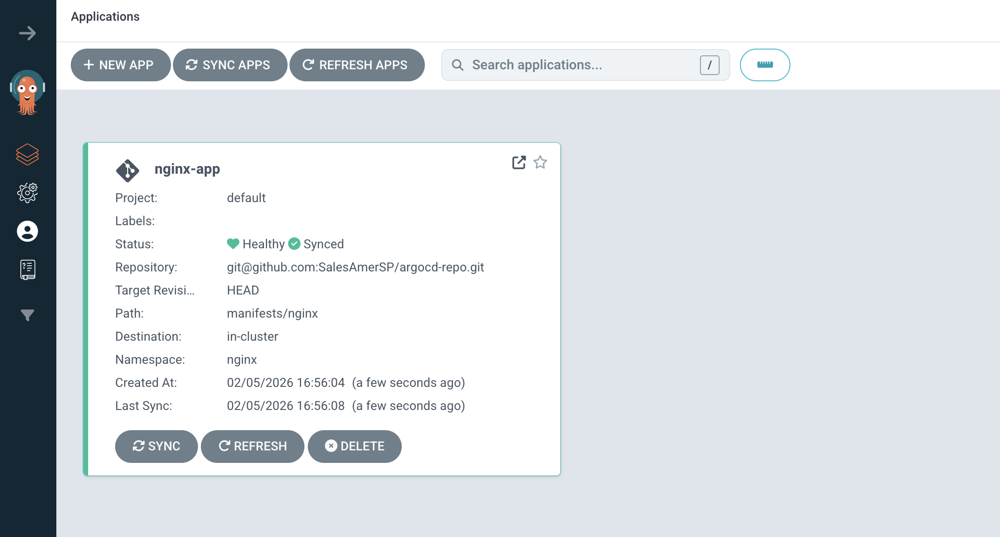

This is the tree view where you can see all the components deployed, check out all the options in the top right. The views are:

Tree <br/>
Pods <br/>
Network <br/>
List <br/>

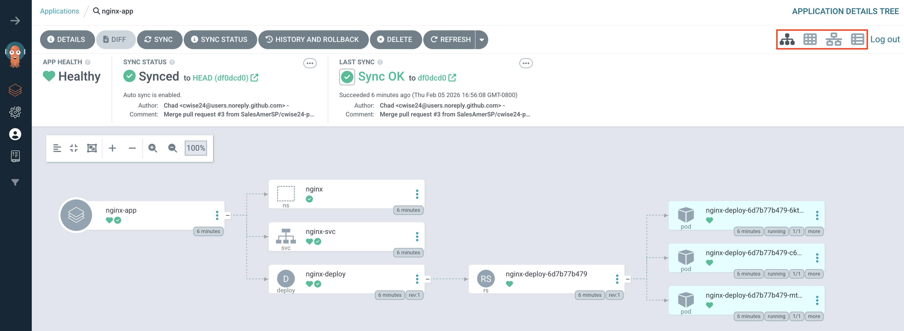

Pod view, from here you can see pod distribution, health. Hover over the pods to see details.

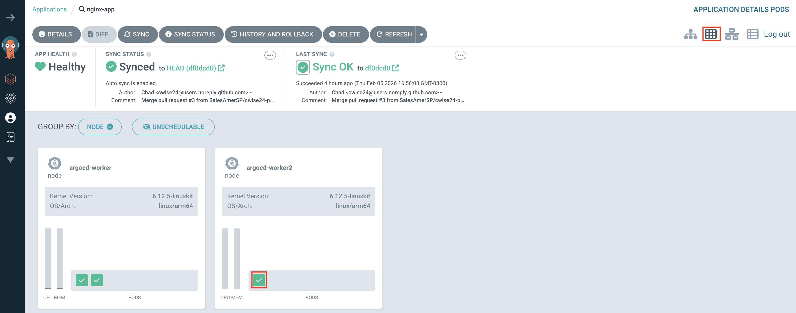

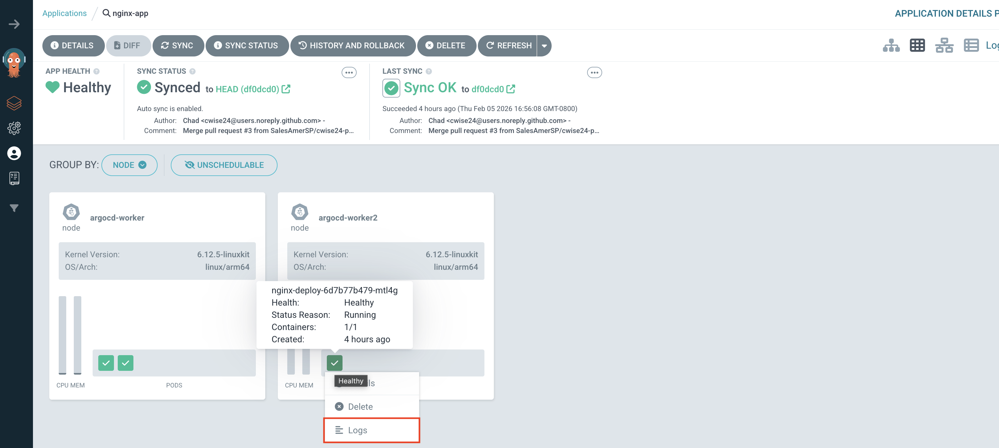

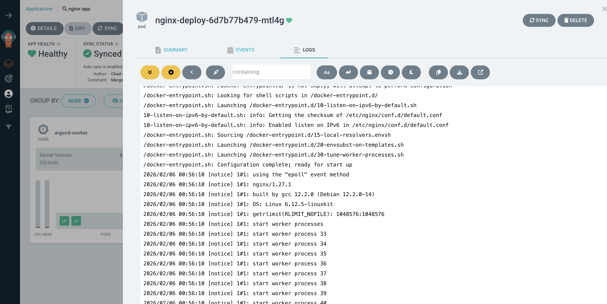

</details>

# Clean Up

```
kind delete cluster --name kubeseal
```
